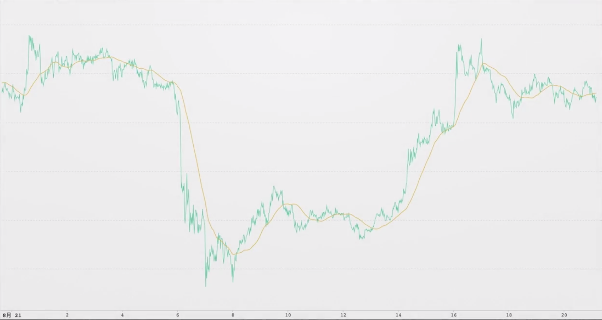
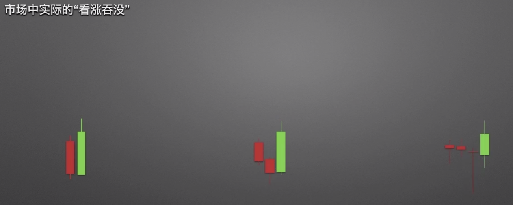

### 本文为k线的基本知识 

一天中的价格在市场中是如何运行的？

分时图了解一下

这样看数据太不直观了，我们标记一天中的最高价（H），最低价（L），开盘价（O）和收盘价（C）来标记当天的价格走势下图看起来是不是清晰很多。

用更简单的方式表达它

开盘价和收盘价之间的柱状图称之为实体，实体和最高价之间的线称之为上影线，实体和最低价之间的线称之为下影线

开盘价低于收盘价称之为阳线，开盘价低于收盘价称之为阴线。简单的来说，阳线看涨，阴线看跌！

一根一天的k线是这样构成，如果取一段k线可以做成k线图，一天的价格可以用k线表示，其他的时间也能用k线来表示。

**k线在投资市场中特定的形态和特定的规律性排列可以反映出市场的动向**

介绍几个经典的例子

**k线的常见形态与寓意**

一字线

小阳线小阴线 

t字线

**十字线墓碑线**

形态

**常见k线看涨的组合**

**主要看阳线长度辨别看涨力度**

**常见看空形态**

(完)

