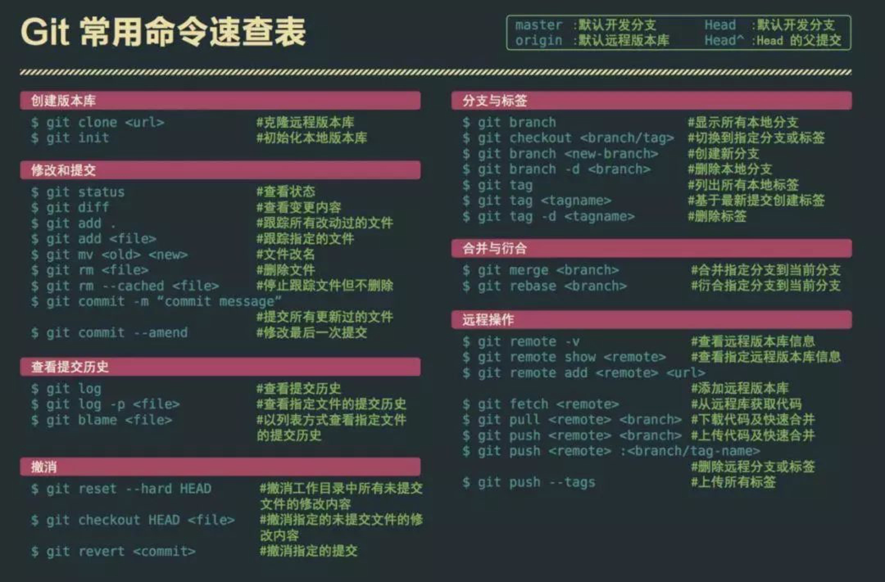
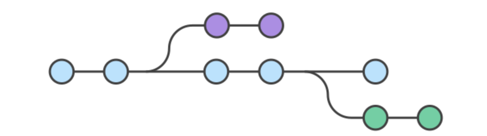

# Git指南

git是世界上最先进的发布式版本控制系统


## **git常用命令**

| 代码                        | 注释                   |
| --------------------------- | ---------------------- |
| `git init`                  | 初始化仓库             |
| `git remote add origin URL` | 绑定远程地址           |
| `git add .`                 | 添加所有改动           |
| `git commit -m NAME`        | 提交本次添加并为其命名 |
| `git push`                  | 提交到远程仓库         |
| `git stash `                | 保存当前修改           |
| `git stash pop`             | 拆包当前修改           |



## **git强制拉取远程仓库覆盖本地**

```shell
git fetch --all                //从另一个存储库下载对象和引用
git reset --hard origin/master //放弃本地修改
git pull                       //开始更新
```


## **git协助流程**

多人协作是强大的功能之一。

多人协作（workflow）必须有一个规范流程，使得项目井井有条的进行。



可以把git抽象为仓库，当执行 git init 命令的时候，文件夹就初始化了一个.git文件夹仓库，
文件夹里的文件以git自己的方式记录当前文件夹的变化，一般来说为了防止用户误操作文件夹破坏仓库完整性，文件夹默认是隐藏的。

当使用git必须要掌握几个术语：

- 仓库（Repository）：一个完整的git项目
- 分支（branch）：拥有自己历史信息的时间线
- 工作区（Workspace）：本地的仓库的提交暂存
- 暂存区（index）:本地代码和远程有冲突的时候可以先存到暂存区

如果现在是一名作家写作流程：

首先需要初始化仓库每次的写完时候进行本地的仓库提交一些信息，然后再同步到远程的仓库，本地提交完成以后本地的仓库中会有你的这次的提交记录，远程仓库会同步本地仓库的所有的操作就记录在云端了。

每次写作操作很简单，只需要两步：

1. 提交本地仓库
2. 提交远程仓库

这样就算完成了最简单的流程

现在作者有多个设备，希望能够在家的时候通过家里的电脑写作，在公司通过公司电脑写作。当前作者仓库都是通过家里的电脑提交的。

1. 在公司的电脑上克隆仓库
2. 进行写作提交本地仓库
3. 提交远程仓库

每次写作的时候只需要先拉取家里电脑的提交的内容然后在进行写作在提交，这样内容就可以连接上，是在一个流水线了。

```
注意：1.如果某一天在家里写了文章忘记提交了，但人已经到公司了。没这种情况应该如何处理呢？  
     2.还有一种情况：在家里提交了，但是到公司脑子里想的就是接着写下去没有拉取家里的提交在公司写完就提交了，这        时候该怎么处理呢？
     
       这是最常见的两类情况！
```

1. 到公司可以接着写，写完提交，到家的时候先把家里的代码保存暂存区，拉去公司写的东西，把暂存区的文章pop进文件然后就算插进来了。再进行本地提交。
2. 第二种情况提交的仓库做了只能处理，提交到远程的时候会提示远程有一个带拉去的最新代码，所以先拉取然后再推送。

再后来。作者的新书出版了。只不过作者打算做一个连载网络版本，每过几天就需要更新一个版本。

1. 本地仓库和远程仓库都已经有了在这个基础上我们需要创建新的分支
2. 第一个分支是每次发布新书的内容，所以没发布一次就提交一次
3. 第二个分支是连载的内容，这个分支的内容完全是和第一个分支一样的。但是会有不同的是连载的内容只在这个分支上写只有到修改完需要发布的时候才会在第一个分支上同步第二个分支上的内容

```
可以理解为第一个分支是主线，第二个分支是最新学习内容
注意：分支的远程和本地的同步问题
     分支的管理问题
     多端分支的提交冲突问题
     提交错误会退的问题
```

后来作者越做越大成立了自己的公司，项目也越来越大，要提交的东西不仅仅是两个分支上的内容后来请来还几个人做翻译，写成译本出售。还有专门的插画师专门做给文章做插画但是还是这个项目为主打

于是作者给每个人都配了git分支 每个人需要把第一分支（主分支）和第二分支（最新连载）分支拉取下来，然后对每个人进行分工，在每个人分别对应的会建立一个属于自己的分支。每个人任务分工明确有几点特别重要

- 每个人只允许在自己的分支直接提交远程分支
- 合并的时候切换到最新分支
- merge你自己分支的内容（有冲突在本地解决再提交）
- 每完成一次任务提交一次

有了这些规则员工会很容易进行开发，项目管理清晰。无论扩展性还是管理性都很容易。

上面的故事

- git适合一个人使用（github flow）模式
- 小项目可以使用主线（git flow）模式
- 大项目使用（gitlab flow）模式

关于git的使用

团队开发中，遵循一个合理、清晰的Git使用流程，是非常重要的。

否则，每个人都提交一堆杂乱无章的commit，项目很快就会变得难以协调和维护。

下面是[ThoughtBot](https://github.com/thoughtbot/guides/tree/master/protocol/git) 的Git使用规范流程。我从中学到了很多，推荐你也这样使用Git。


## 第一步：新建分支

首先，每次开发新功能，都应该新建一个单独的分支。

> ```bash
> # 获取主干最新代码
> $ git checkout master
> $ git pull
> 
> # 新建一个开发分支myfeature
> $ git checkout -b myfeature
> ```

## 第二步：提交分支commit

分支修改后，就可以提交commit了。

> ```bash
> $ git add --all
> $ git status
> $ git commit --verbose
> ```

git add 命令的all参数，表示保存所有变化（包括新建、修改和删除）。从Git 2.0开始，all是 git add 的默认参数，所以也可以用 git add . 代替。

git status 命令，用来查看发生变动的文件。

git commit 命令的verbose参数，会列出diff 的结果。

## 第三步：撰写提交信息

提交commit时，必须给出完整扼要的提交信息，下面是一个范本。

> ```bash
> Present-tense summary under 50 characters
> 
> * More information about commit (under 72 characters).
> * More information about commit (under 72 characters).
> 
> http://project.management-system.com/ticket/123
> ```

第一行是不超过50个字的提要，然后空一行，罗列出改动原因、主要变动、以及需要注意的问题。最后，提供对应的网址（比如Bug ticket）。

## 第四步：与主干同步

分支的开发过程中，要经常与主干保持同步。

> ```bash
> $ git fetch origin
> $ git rebase origin/master
> ```

## 第五步：合并commit

分支开发完成后，很可能有一堆commit，但是合并到主干的时候，往往希望只有一个（或最多两三个）commit，这样不仅清晰，也容易管理。

那么，怎样才能将多个commit合并呢？这就要用到 git rebase 命令。

> ```bash
> $ git rebase -i origin/master
> ```

git rebase命令的i参数表示互动（interactive），这时git会打开一个互动界面，进行下一步操作。

下面采用[Tute Costa](https://robots.thoughtbot.com/git-interactive-rebase-squash-amend-rewriting-history)的例子，来解释怎么合并commit。

> ```bash
> pick 07c5abd Introduce OpenPGP and teach basic usage
> pick de9b1eb Fix PostChecker::Post#urls
> pick 3e7ee36 Hey kids, stop all the highlighting
> pick fa20af3 git interactive rebase, squash, amend
> 
> # Rebase 8db7e8b..fa20af3 onto 8db7e8b
> #
> # Commands:
> #  p, pick = use commit
> #  r, reword = use commit, but edit the commit message
> #  e, edit = use commit, but stop for amending
> #  s, squash = use commit, but meld into previous commit
> #  f, fixup = like "squash", but discard this commit's log message
> #  x, exec = run command (the rest of the line) using shell
> #
> # These lines can be re-ordered; they are executed from top to bottom.
> #
> # If you remove a line here THAT COMMIT WILL BE LOST.
> #
> # However, if you remove everything, the rebase will be aborted.
> #
> # Note that empty commits are commented out
> ```

上面的互动界面，先列出当前分支最新的4个commit（越下面越新）。每个commit前面有一个操作命令，默认是pick，表示该行commit被选中，要进行rebase操作。

4个commit的下面是一大堆注释，列出可以使用的命令。

> - pick：正常选中
> - reword：选中，并且修改提交信息；
> - edit：选中，rebase时会暂停，允许你修改这个commit
> - squash：选中，会将当前commit与上一个commit合并
> - fixup：与squash相同，但不会保存当前commit的提交信息
> - exec：执行其他shell命令

上面这6个命令当中，squash和fixup可以用来合并commit。先把需要合并的commit前面的动词，改成squash（或者s）。

> ```bash
> pick 07c5abd Introduce OpenPGP and teach basic usage
> s de9b1eb Fix PostChecker::Post#urls
> s 3e7ee36 Hey kids, stop all the highlighting
> pick fa20af3 git interactive rebase, squash, amend
> ```

这样一改，执行后，当前分支只会剩下两个commit。第二行和第三行的commit，都会合并到第一行的commit。提交信息会同时包含，这三个commit的提交信息。

> ```bash
> # This is a combination of 3 commits.
> # The first commit's message is:
> Introduce OpenPGP and teach basic usage
> 
> # This is the 2nd commit message:
> Fix PostChecker::Post#urls
> 
> # This is the 3rd commit message:
> Hey kids, stop all the highlighting
> ```

如果将第三行的squash命令改成fixup命令。

> ```bash
> pick 07c5abd Introduce OpenPGP and teach basic usage
> s de9b1eb Fix PostChecker::Post#urls
> f 3e7ee36 Hey kids, stop all the highlighting
> pick fa20af3 git interactive rebase, squash, amend
> ```

运行结果相同，还是会生成两个commit，第二行和第三行的commit，都合并到第一行的commit。但是，新的提交信息里面，第三行commit的提交信息，会被注释掉。

> ```bash
> # This is a combination of 3 commits.
> # The first commit's message is:
> Introduce OpenPGP and teach basic usage
> 
> # This is the 2nd commit message:
> Fix PostChecker::Post#urls
> 
> # This is the 3rd commit message:
> # Hey kids, stop all the highlighting
> ```

[Pony Foo](http://ponyfoo.com/articles/git-github-hacks)提出另外一种合并commit的简便方法，就是先撤销过去5个commit，然后再建一个新的。

> ```bash
> $ git reset HEAD~5
> $ git add .
> $ git commit -am "Here's the bug fix that closes #28"
> $ git push --force
> ```

squash和fixup命令，还可以当作命令行参数使用，自动合并commit。

> ```bash
> $ git commit --fixup  
> $ git rebase -i --autosquash 
> ```

## 第六步：推送到远程仓库

合并commit后，就可以推送当前分支到远程仓库了。

> ```bash
> $ git push --force origin myfeature
> ```

git push命令要加上force参数，因为rebase以后，分支历史改变了，跟远程分支不一定兼容，有可能要强行推送

## 第七步：发出Pull Request

提交到远程仓库以后，就可以发出 Pull Request 到master分支，然后请求别人进行代码review，确认可以合并到master。

## 基本配置
```bash
# 查看当前生效的配置信息
$ git config -l

# 配置提交用户信息，--global代表全局
$ git config --global user.name <用户名>
$ git config --global user.email <邮箱地址>

# 更改Git缓存区的大小
# 缓存大小单位：B，例如：524288000（500MB）
$ git config --global http.postBuffer <缓存大小>

# 配置可以缓存密码，默认缓存时间15分钟
# 缓存时间单位：秒
$ git config --global credential.helper 'cache --timeout=<缓存时间>'

# 配置长期存储密码
$ git config --global credential.helper store
```
## 基础操作

```bash
# 初始化本地仓库，在当前目录下生成 .git 文件夹
$ git init

# 查看本地仓库的状态
$ git status

# 把指定1个或多个文件添加到暂存区中
$ git add <文件路径>

# 将工作区所有变化提交到暂存区，包括修改、新文件和删除文件。
$ git add . 
$ git add -A <文件路径>
$ git add --all <文件路径>

# 添加所有修改、已删除的文件到暂存区中，不包含新增文件
$ git add -u [<文件路径>]

# 移除跟踪指定的文件，并从本地仓库的文件夹中删除
$ git rm <文件路径>

# 移除跟踪指定的文件夹，并从本地仓库的文件夹中删除
$ git rm -r <文件夹路径>

# 移除跟踪指定的文件，在本地仓库的文件夹中保留该文件
$ git rm --cached

# 撤消工作区对文件的修改, 慎用
$ git checkout -- <文件名>

# 把暂存区中的文件提交到本地仓库中并添加描述信息
$ git commit -m "<提交的描述信息>"

# 修改上次提交的描述信息
$ git commit --amend

# 打印所有的提交记录，使用--oneline选项可以简化输出
$ git log 

# 使用--author选项可以打印出某个用户的提交记录
$ git log --author="大江狗"
```
## 版本回退
```bash
# 可查看所有分支的操作记录（包括已被删除的 commit 记录和 reset 的操作）
$ git reflog 

# 将 HEAD 的指向改变，回退到commit前的状态，文件未改变
$ git reset --soft <commit ID>

# 将 HEAD 的指向改变，文件被修改，均回到之前版本
$ git reset --hard <commit ID>

# 回退到上个版本
$ git reset --hard HEAD^

# 回退到前2次提交之前，以此类推，回退到n次提交之前
$ git reset --hard HEAD~3 

# 按提交id，可以回退，也可以前进
$ git reset --hard <commit ID>

# 生成一个新的提交来撤销某次提交
$ git revert <commit ID>
```

## 远程操作
```bash
# 列出已经存在的远程仓库
$ git remote

# 列出远程仓库的详细信息，在别名后面列出URL地址
$ git remote -v

# 添加远程仓库，别名一般默认origin
$ git remote add <远程仓库的别名> <远程仓库的URL地址>

# 修改远程仓库的别名
$ git remote rename <原远程仓库的别名> <新的别名>

# 删除指定名称的远程仓库
$ git remote remove <远程仓库的别名>

# 修改远程仓库的 URL 地址
$ git remote set-url <远程仓库的别名> <新的远程仓库URL地址>

# 将远程仓库所有分支的最新版本全部取回到本地
$ git fetch <远程仓库的别名>

# 将远程仓库指定分支的最新版本取回到本地
$ git fetch <远程主机名> <分支名>

# 把指定的分支合并到当前所在的分支下
$ git merge <分支名称>

# 从远程仓库获取最新版本，并合并，等于fetch + merge
$ git pull

# 把本地仓库的分支推送到远程仓库的指定分支
$ git push <远程仓库的别名> <本地分支名>:<远程分支名>

# 首次使用u推送后，下次无需设置别名和本地分支可直接git push。
$ git push -u origin main

# 删除指定的远程仓库的分支
$ git push <远程仓库的别名> :<远程分支名>
$ git push <远程仓库的别名> --delete <远程分支名>

# 删除指定的远程仓库的分支
$ git push <远程仓库的别名> :<远程分支名>
$ git push <远程仓库的别名> --delete <远程分支名>

# 将远程仓库代码复制一份到本地当前目录
$ git clone <远程仓库的网址>

# 指定本地仓库的目录
$ git clone <远程仓库的网址> <本地目录>

# -b 指定要克隆的分支，默认是main分支
$ git clone <远程仓库的网址> -b <分支名称> <本地目录>
```
## 分支操作
```bash
# 列出本地的所有分支，当前所在分支以 "*" 标出
$ git branch

# 同时列出本地和远程的所有分支
$ git branch -a

# 列出本地的所有分支并显示最后一次提交，当前所在分支以 "*" 标出
$ git branch -v

# 创建新分支，新的分支基于上一次提交建立
$ git branch <分支名>

# 修改分支名称
# 如果不指定原分支名称则为当前所在分支
$ git branch -m [<原分支名称>] <新的分支名称>

# 强制修改分支名称
$ git branch -M [<原分支名称>] <新的分支名称>

# 删除指定的本地分支
$ git branch -d <分支名称>

# 强制删除指定的本地分支
$ git branch -D <分支名称>

# 删除远程分支
$ git push origin --delete <分支名称>

# 切换到已存在的指定分支，如git checkout main
$ git checkout <分支名称>

# 与指定分支合并，比如将刚切换的main分支与dev分支合并
# 合并前建议先拉取git pull origin main，然后再合并
$ git merge dev

# 把已经提交的记录合并到当前分支
$ git cherry-pick <commit ID>

# 创建+切换到指定的分支，保留所有的提交记录
# 等同于 "git branch" 和 "git checkout" 两个命令合并
$ git checkout -b <分支名称>

# 创建+切换到指定的分支，删除所有的提交记录
$ git checkout --orphan <分支名称>
```
分支命令时一定要注意遵循一定规范，常见的分支名有：

- main: 主分支
- dev: 开发分支
- hotfix : 紧急修复主分支的bug，可以按issue编号命令，如hotfix/#1，方便与main主分支合并
- feature : 按照功能点命名 feature/新增功能，如 feature/add_search。

## 标签管理

```bash
# 打印所有的标签
$ git tag

# 添加轻量标签，指向提交对象的引用，可以指定之前的提交记录
$ git tag <标签名称> [<commit ID>]

# 添加带有描述信息的附注标签，可以指定之前的提交记录
$ git tag -a <标签名称> -m <标签描述信息> [<commit ID>]

# 切换到指定的标签
$ git checkout <标签名称>

# 查看标签的信息
$ git show <标签名称>

# 删除指定的标签
$ git tag -d <标签名称>

# 将指定的标签提交到远程仓库
$ git push <远程仓库的别名> <标签名称>

# 将本地所有的标签全部提交到远程仓库
$ git push <远程仓库的别名> –tags
```

## Git常见使用场景

```bash
# 服务器上首次安装git并通过SSH连接github
$ sudo apt-get install git # ubuntu系统
$ git config --global user.name "Your name here"
$ git config --global user.email "your_email@example.com"
$ ssh-keygen -t rsa -C "your_email@example.com"
# 打开隐藏.ssh/id_rsa.pub，复制key
# 打开Github Account Settings > Add SSH Key
$ ssh -T git@github.com
# 阿里云连接github慢，取消GSSAPIAuthentication no的注释
vim /etc/ssh/ssh_config

# 开发分支（dev）上的代码达到上线的标准后，要合并到main分支
$ git checkout dev
$ git pull
$ git checkout main
$ git merge dev
$ git push -u origin main

# 当master代码改动了，需要更新开发分支（dev）上的代码
$ git checkout main
$ git pull 
$ git checkout dev
$ git merge main
$ git push -u origin dev

# 放弃本地修改，使用远程仓库代码强制覆盖本地命令
$ git fetch --all
$ git reset --hard origin/main
$ git pull

# 多分支实现小的功能改动
$ git checkout -b feature/add_search dev # 创建两个分支feature和dev
$ git add somefile # 做出小的修改
$ git commit -m 'msg' # 提交修改
$ git checkout dev # 切换到开发分支
$ git pull # 拉取远程代码与本地dev分支合并
$ git merge feature/add_search # 将minor_feature与dev分支合并
$ git push # 提交到远程仓库dev分支
$ git checkout main # 切换到main分支
$ git merge dev # 将dev与main分支合并
$ git push # 提交到远程仓库main分支
```


