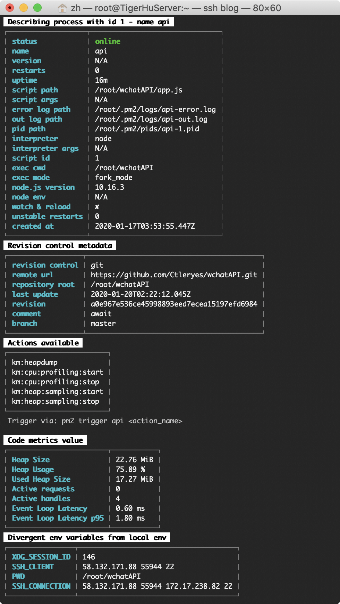
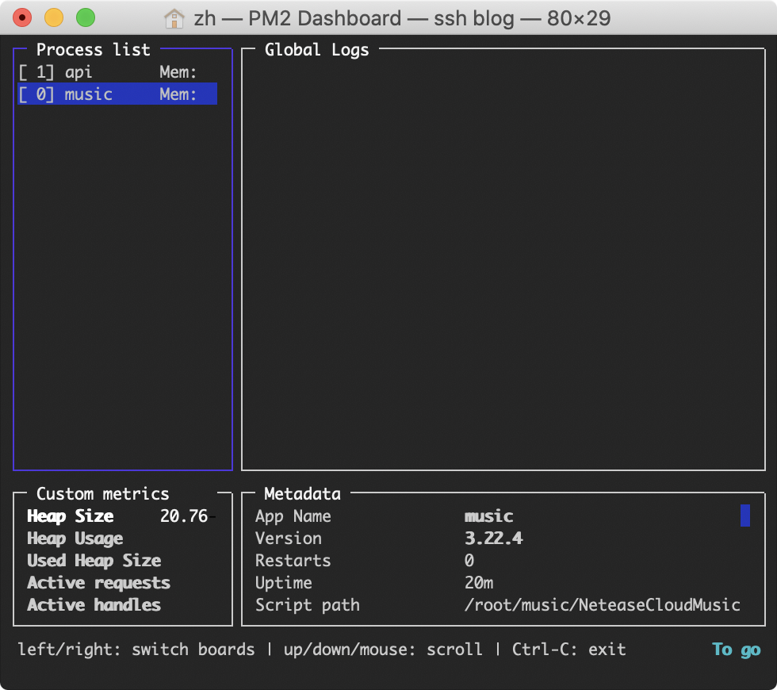

##### PM2

[Pm2](https://pm2.keymetrics.io/) 是一个项目运行的进程管理器用起来还是很nice的

- 管理进程
- 监听文件自动重启项目
- 性能监控
- 负载均衡
- 自动化部署


**安装**

```shell
$ npm install pm2@latest -g
# or
$ yarn global add pm2
```


**运行**

```shell
# run node 
$ pm2 start app.js
# run shell
$ pm2 start bashscript.sh
# run python --watch mean if project anywhere changed project restart
$ pm2 start python-app.py --watch
# run file and --port set port 
$ pm2 start binary-file -- --port 1520
```


**常用参数**

```sh
# Specify an app name
--name <app_name>

# Watch and Restart app when files change
--watch

# Set memory threshold for app reload
--max-memory-restart <200MB>

# Specify log file
--log <log_path>

# Pass extra arguments to the script
-- arg1 arg2 arg3

# Delay between automatic restarts
--restart-delay <delay in ms>

# Prefix logs with time
--time

# Do not auto restart app
--no-autorestart

# Specify cron for forced restart
--cron <cron_pattern>

# Attach to application log
--no-daemon
```


**项目管理命令**

```shell
$ pm2 restart app_name
$ pm2 reload app_name
$ pm2 stop app_name
$ pm2 delete app_name 
```


**查看正在运行的项目和状态**

```shell
$ pm2 [list|ls|status]
# 查看日志
$ pm2 logs
# 查看最后两百行日志
$ pm2 logs --lines 200
```

```shell
 # 查看某个项目的详情
 $ pm2 describe app
```




**查看进程消耗情况**

```shell
 $ pm2 monit
```



**设置pm2开机自启**

开启启动设置，此处是CentOS系统，其他系统替换最后一个选项（可选项：ubuntu, centos, redhat, gentoo, systemd, darwin, amazon）

```shell
$ pm2 startup centos 
```

然后按照提示需要输入的命令进行输入

最后保存设置

```shell
$ pm2 save
```

**Pm2 有能自动化部署项目**

```shell
# 生成运行脚本
$ pm2 ecosystem

```

```javascript
// ecosystem.config.js
module.exports = {
  apps : [{
    name: 'wchatAPI',  //项目名称
    script: 'app.js',  //启动入口文件
    // Options reference: https://pm2.keymetrics.io/docs/usage/application-declaration/
    args: 'one two',   // 参数
    instances: 1,       
    autorestart: true, 
    watch: false, 
    max_memory_restart: '1G',
    env: {
      NODE_ENV: 'development'
    },
    env_production: {
      NODE_ENV: 'production'
    }
  }],

  deploy : {
    production : {
      user : 'root', //服务器用户名
      host : 'XXX.XXX.XXX.XXX', // 服务器ip地址
      ref  : 'origin/master', // git分支
      repo : 'https://github.com/Ctleryes/wchatAPI.git', // git地址
      path : '/root/wchatAPI',  // 服务器要拉取的路径
      'pre-deploy': 'git fetch --all',  //部署前执行的代码
      'post-deploy' : 'npm install && pm2 reload ecosystem.config.js --env production'
    }
  }
};

```

上面只是基本的配置，详细的配置访问 [PM2配置](https://pm2.keymetrics.io/docs/usage/application-declaration/)

部署

```shell
# 首次部署
$ pm2 deploy ecosystem.config.js production setup
# 更新
$ pm2 deploy ecosystem.config.js production update
```


